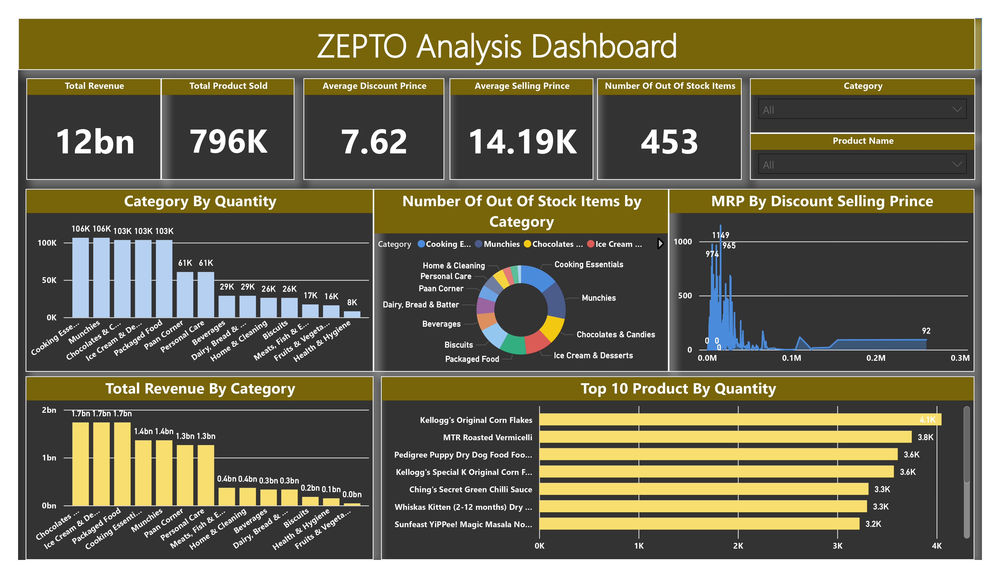

# Zepto Retail Analytics

A real-world SQL portfolio project based on Zepto's e-commerce inventory dataset, focused on pricing, discounts, stock availability, and retail business insights.

## Business Problem
Quick-commerce companies need to optimize pricing, inventory, and product strategy to improve operational efficiency and customer satisfaction. This project analyzes Zepto's product catalog to identify pricing patterns, discount strategies, stock issues, and revenue opportunities.

## Project Objectives
- Build a structured SQL database from a real-world e-commerce dataset
- Perform exploratory data analysis on product categories and availability
- Clean inconsistent and invalid pricing data
- Generate business-driven insights using SQL

## Dataset Overview
The dataset contains 3,000+ SKUs from Zepto's product catalog and includes:
- sku_id
- name
- category
- mrp
- discountPercent
- discountedSellingPrice
- availableQuantity
- weightInGms
- outOfStock
- quantity

## Tools Used
- PostgreSQL
- pgAdmin 4
- SQL
- Power BI
- GitHub

## Project Workflow
1. Database and table creation
2. Data import
3. Data exploration
4. Data cleaning
5. Business insights

## Key Insights
- Top discounted products were identified across categories
- Several high-MRP products were out of stock
- Revenue potential varied significantly by category
- Some expensive products had very low discounts
- Price-per-gram analysis revealed better value products

## 📊 Dashboard Preview

  

## Repository Structure
data/           # dataset files
sql/            # SQL scripts
docs/           # project report
images/         # screenshots and visuals
presentation/   # project slides

## Author
Florian Mata  
Data Analyst Portfolio Project
